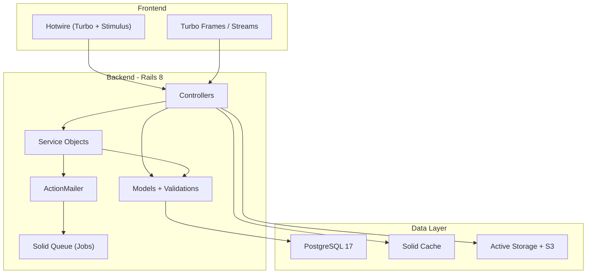
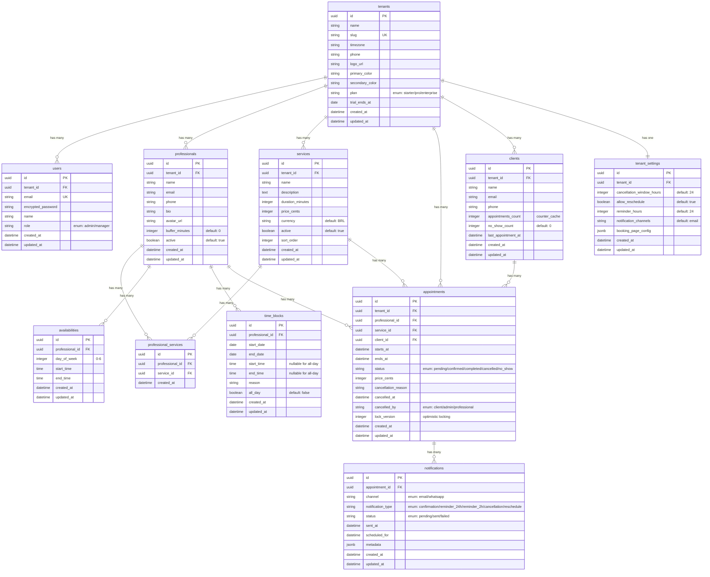

# 🏗️ Plano de Arquitetura — Agenda AI MVP

> **Rails Architect** — Plano técnico para os Módulos 1-5 do MVP  
> Baseado em: [JTBD.md](file:///home/mario/agenda-ai/docs/product/JTBD.md), [ROADMAP.md](file:///home/mario/agenda-ai/docs/product/ROADMAP.md), [FEATURES.md](file:///home/mario/agenda-ai/docs/product/FEATURES.md)

---

## User Review Required

> [!IMPORTANT]
> **Decisões de stack que precisam de aprovação antes da implementação:**
> 1. **Multi-tenancy:** Recomendo `acts_as_tenant` com scoping por `slug` no path (ex: `agenda-ai.com.br/meusalao`) em vez de subdomínio — mais simples para deploy e SSL. Alternativa: subdomínio requer wildcard DNS + certificado wildcard.
> 2. **Autenticação:** Recomendo `Devise` por maturidade e ecossistema, mas `Rodauth` é mais moderno e seguro por padrão. Qual prefere?
> 3. **Background Jobs:** Recomendo `Solid Queue` (nativo Rails 8, sem Redis) em vez de Sidekiq.
> 4. **Testes:** Recomendo `RSpec` + `FactoryBot` + `Shoulda Matchers`. Prefere Minitest?
> 5. **Deploy:** `Kamal 2` + Docker (conforme roadmap).

> [!WARNING]
> **Pagamento e WhatsApp são pós-MVP** (v1.1). Este plano **NÃO** inclui Stripe/Mercado Pago nem Evolution API/Twilio. Apenas email para notificações.

---

## Open Questions

1. **Timezone:** Cada tenant terá seu próprio timezone? (Recomendo: sim, campo `timezone` no modelo `Tenant`)
2. **Idioma:** MVP apenas pt-BR ou já preparar i18n?
3. **Domínio customizado:** Tenants poderão usar domínio próprio no futuro? (Impacta arquitetura de roteamento)
4. **Storage de imagens:** Active Storage com S3/R2 ou local? (Recomendo: S3-compatible desde o início)
5. **CI/CD:** GitHub Actions? (Recomendo: sim)

---

## 📐 Arquitetura Macro



---

## 🛠 Stack Recomendada

| Camada | Tecnologia | Versão | Justificativa |
|--------|-----------|--------|---------------|
| **Linguagem** | Ruby | 3.3+ | Latest stable, YJIT habilitado |
| **Framework** | Rails | 8.0+ | Hotwire nativo, Solid Queue, Solid Cache |
| **Banco** | PostgreSQL | 17+ | JSONB, window functions, performance |
| **Frontend** | Hotwire (Turbo + Stimulus) | — | Nativo Rails 8, sem SPA complexity |
| **CSS** | Tailwind CSS 4 | 4.x | Produtividade, design system |
| **Jobs** | Solid Queue | — | Nativo Rails 8, sem Redis |
| **Cache** | Solid Cache | — | Nativo Rails 8, DB-backed |
| **Email** | ActionMailer + Postmark | — | Deliverability confiável |
| **Multi-tenancy** | acts_as_tenant | Latest | Scoping automático, battle-tested |
| **Auth** | Devise | Latest | Maturidade, extensibilidade |
| **Testes** | RSpec + FactoryBot | Latest | Padrão da indústria |
| **Deploy** | Kamal 2 + Docker | Latest | Declarativo, zero-downtime |
| **Server** | Puma | — | Nativo Rails, threaded |

---

## 🗃️ Schema do Banco de Dados

### Diagrama ER



### Índices Críticos

```sql
-- Performance de queries multi-tenant
CREATE INDEX idx_appointments_tenant_starts ON appointments(tenant_id, starts_at);
CREATE INDEX idx_appointments_professional_starts ON appointments(professional_id, starts_at, status);
CREATE INDEX idx_appointments_client ON appointments(client_id);
CREATE INDEX idx_appointments_status ON appointments(tenant_id, status);

-- Busca de slots disponíveis
CREATE INDEX idx_availabilities_professional_day ON availabilities(professional_id, day_of_week);
CREATE INDEX idx_time_blocks_professional_dates ON time_blocks(professional_id, start_date, end_date);

-- Lookup de tenant
CREATE UNIQUE INDEX idx_tenants_slug ON tenants(slug);

-- Lookup de client por tenant
CREATE INDEX idx_clients_tenant_email ON clients(tenant_id, email);
CREATE INDEX idx_clients_tenant_phone ON clients(tenant_id, phone);
```

---

## 🏢 Estrutura de Diretórios

```
app/
├── controllers/
│   ├── application_controller.rb
│   ├── public/                     # Controllers da booking page (sem auth)
│   │   ├── booking_controller.rb
│   │   └── tenant_pages_controller.rb
│   ├── admin/                      # Controllers do painel admin (com auth)
│   │   ├── base_controller.rb      # before_action :authenticate_user!
│   │   ├── dashboard_controller.rb
│   │   ├── professionals_controller.rb
│   │   ├── services_controller.rb
│   │   ├── appointments_controller.rb
│   │   └── settings_controller.rb
│   └── api/                        # API interna (Turbo Streams)
│       └── v1/
│           └── slots_controller.rb
├── models/
│   ├── tenant.rb
│   ├── user.rb
│   ├── professional.rb
│   ├── service.rb
│   ├── professional_service.rb
│   ├── availability.rb
│   ├── time_block.rb
│   ├── client.rb
│   ├── appointment.rb
│   ├── notification.rb
│   └── tenant_setting.rb
├── services/                       # Service Objects (business logic)
│   ├── slots/
│   │   ├── availability_calculator.rb   # Calcula slots disponíveis
│   │   └── slot_finder.rb              # Busca slots para uma data
│   ├── appointments/
│   │   ├── creator.rb                  # Cria appointment com lock
│   │   ├── canceller.rb               # Cancela com política
│   │   └── rescheduler.rb             # Reagenda
│   ├── notifications/
│   │   ├── dispatcher.rb              # Despacha notificação por canal
│   │   └── reminder_scheduler.rb      # Agenda lembretes futuros
│   └── onboarding/
│       └── tenant_setup.rb            # Setup inicial do tenant
├── jobs/
│   ├── send_notification_job.rb
│   ├── schedule_reminders_job.rb
│   └── mark_no_show_job.rb
├── mailers/
│   ├── appointment_mailer.rb
│   └── tenant_mailer.rb
├── views/
│   ├── layouts/
│   │   ├── application.html.erb        # Layout admin
│   │   └── public.html.erb             # Layout booking page
│   ├── public/
│   │   ├── booking/                    # Fluxo de agendamento
│   │   └── tenant_pages/              # Landing page do tenant
│   └── admin/
│       ├── dashboard/
│       ├── professionals/
│       ├── services/
│       ├── appointments/
│       └── settings/
└── javascript/
    └── controllers/                    # Stimulus controllers
        ├── booking_controller.js       # Fluxo de agendamento step-by-step
        ├── calendar_controller.js      # Calendário de slots
        ├── availability_controller.js  # Config de disponibilidade
        └── dashboard_controller.js     # Gráficos e filtros
```

---

## Proposed Changes

### Módulo 1: Multi-Tenancy & Onboarding

> Fundação do sistema. Todos os outros módulos dependem deste.

#### [NEW] Migrations — Tenant, User, TenantSetting

- Migration `create_tenants`: UUIDs, slug único, campos de branding, plan (enum)
- Migration `create_users`: Devise fields, `tenant_id` FK, role enum
- Migration `create_tenant_settings`: Configurações do tenant

#### [NEW] Models — Tenant, User, TenantSetting

- `Tenant`: validações de slug (uniqueness, format), `has_many` para todas as entidades
- `User`: Devise modules (:database_authenticatable, :recoverable, :rememberable, :validatable)
- `TenantSetting`: defaults para cancellation_window, notification channels

#### [NEW] Middleware/Controller — Tenant Resolution

- `SetCurrentTenant` concern no `ApplicationController`
- Resolução via `params[:tenant_slug]` no path
- Rotas: `/:tenant_slug/admin/...` e `/:tenant_slug/booking/...`

#### [NEW] `Onboarding::TenantSetup` service

- Cria tenant, user admin, tenant_settings em uma transaction
- Envia email de boas-vindas

---

### Módulo 2: Gestão de Profissionais & Serviços

#### [NEW] Migrations — Professional, Service, ProfessionalService, Availability, TimeBlock

- Todas com `tenant_id` FK e `acts_as_tenant`
- `professional_services`: join table many-to-many
- `availabilities`: horários semanais por dia (0=domingo...6=sábado)
- `time_blocks`: bloqueios pontuais (férias, folgas)

#### [NEW] Models com validações

```ruby
# Professional
validates :name, presence: true
validates :email, format: { with: URI::MailTo::EMAIL_REGEXP }, allow_blank: true
validates :buffer_minutes, numericality: { greater_than_or_equal_to: 0 }
scope :active, -> { where(active: true) }

# Service
validates :name, presence: true
validates :duration_minutes, numericality: { greater_than: 0 }
validates :price_cents, numericality: { greater_than_or_equal_to: 0 }

# Availability
validates :day_of_week, inclusion: { in: 0..6 }
validate :end_time_after_start_time
validates :professional_id, uniqueness: { scope: [:day_of_week, :start_time] }
```

#### [NEW] `Admin::ProfessionalsController` + `Admin::ServicesController`

- CRUD completo com Turbo Frames
- Inline editing para disponibilidade semanal

---

### Módulo 3: Motor de Agendamento (Core)

> **Componente mais crítico do sistema.** Responsável por calcular slots e prevenir conflitos.

#### [NEW] `Slots::AvailabilityCalculator`

```ruby
# Algoritmo de cálculo de slots:
# 1. Buscar availabilities do professional para o day_of_week da data
# 2. Gerar slots de acordo com service.duration_minutes + professional.buffer_minutes
# 3. Subtrair: appointments existentes (confirmed/pending) naquele período
# 4. Subtrair: time_blocks que cobrem aquele período
# 5. Retornar array de slots disponíveis [{starts_at:, ends_at:}]
```

#### [NEW] `Appointments::Creator` — com prevenção de double-booking

```ruby
class Appointments::Creator
  def call(tenant:, professional:, service:, client_params:, starts_at:)
    ActiveRecord::Base.transaction do
      # 1. Find or create client
      client = find_or_create_client(tenant, client_params)

      # 2. Verificar disponibilidade (com lock pessimístico)
      raise SlotUnavailableError unless slot_available?(professional, starts_at, service)

      # 3. Criar appointment
      appointment = Appointment.create!(
        tenant:, professional:, service:, client:,
        starts_at:,
        ends_at: starts_at + service.duration_minutes.minutes,
        price_cents: service.price_cents,
        status: :confirmed
      )

      # 4. Disparar notificações
      Notifications::Dispatcher.new(appointment).dispatch(:confirmation)
      Notifications::ReminderScheduler.new(appointment).schedule

      appointment
    end
  end

  private

  def slot_available?(professional, starts_at, service)
    ends_at = starts_at + service.duration_minutes.minutes

    # Lock pessimístico para prevenir race condition
    conflicting = Appointment
      .where(professional:)
      .where(status: [:pending, :confirmed])
      .where("starts_at < ? AND ends_at > ?", ends_at, starts_at)
      .lock("FOR UPDATE SKIP LOCKED")

    conflicting.none?
  end
end
```

#### [NEW] `Public::BookingController`

- Fluxo multi-step com Turbo Frames:
  1. `GET /:slug/booking` → Lista serviços
  2. `GET /:slug/booking/professionals?service_id=X` → Lista profissionais
  3. `GET /:slug/booking/slots?professional_id=X&service_id=X&date=Y` → Slots
  4. `POST /:slug/booking` → Confirma agendamento

---

### Módulo 4: Notificações & Lembretes

#### [NEW] `Notifications::Dispatcher`

```ruby
class Notifications::Dispatcher
  TYPES = %i[confirmation reminder_24h reminder_2h cancellation reschedule].freeze

  def dispatch(type)
    channels = appointment.tenant.tenant_setting.notification_channels
    channels.each do |channel|
      notification = Notification.create!(
        appointment:, channel:, notification_type: type, status: :pending
      )
      SendNotificationJob.perform_later(notification.id)
    end
  end
end
```

#### [NEW] `SendNotificationJob` — Solid Queue

- Processa email via `AppointmentMailer`
- Retry 3x com backoff exponencial
- Atualiza `notification.status` para `sent` ou `failed`

#### [NEW] `ScheduleRemindersJob`

- Enfileira `SendNotificationJob` agendado para 24h e 2h antes
- Usa `Solid Queue` scheduled jobs (`set(wait_until: ...)`)

#### [NEW] `MarkNoShowJob` — Cron diário

- Roda via `Solid Queue` recurring
- Marca como `no_show` appointments `confirmed` cuja `ends_at` já passou sem `completed`

---

### Módulo 5: Dashboard & Métricas

#### [NEW] `Admin::DashboardController`

- Queries otimizadas com `group`, `count`, `sum`
- Cache com Solid Cache (TTL 5 min para métricas)
- Turbo Frames para filtros de período (hoje/7d/30d/custom)

#### Métricas calculadas:

```ruby
# Agendamentos por período
Appointment.where(tenant: current_tenant)
           .where(starts_at: period_range)
           .group(:status).count

# Taxa de no-show
no_shows = appointments.where(status: :no_show).count
total = appointments.where.not(status: :cancelled).count
rate = (no_shows.to_f / total * 100).round(1)

# Taxa de ocupação por profissional
available_slots = Slots::AvailabilityCalculator.total_slots(professional, period)
booked_slots = appointments.where(professional:).count
occupancy = (booked_slots.to_f / available_slots * 100).round(1)

# Faturamento estimado
revenue = appointments.where(status: [:confirmed, :completed])
                      .sum(:price_cents) / 100.0
```

#### [NEW] Frontend — Chart.js via Stimulus

- Gráfico de barras: agendamentos por dia
- Gráfico de linha: evolução do faturamento
- Gráfico de pizza: distribuição por serviço

---

### Módulo 7: Planos & Billing (Enforcement no MVP)

> No MVP, apenas enforcement de limites. Cobrança real via Stripe será v1.1.

#### [NEW] `PlanEnforcer` concern

```ruby
module PlanEnforcer
  extend ActiveSupport::Concern

  LIMITS = {
    starter: { professionals: 1, services: 5, appointments_per_month: 50 },
    pro:     { professionals: 10, services: Float::INFINITY, appointments_per_month: Float::INFINITY },
    enterprise: { professionals: Float::INFINITY, services: Float::INFINITY, appointments_per_month: Float::INFINITY }
  }.freeze

  def within_plan_limit?(resource_type)
    limit = LIMITS[tenant.plan.to_sym][resource_type]
    current_count = count_resource(resource_type)
    current_count < limit
  end
end
```

---

## 🗺️ Rotas

```ruby
# config/routes.rb
Rails.application.routes.draw do
  # Devise (admin auth)
  devise_for :users

  # Tenant-scoped routes
  scope "/:tenant_slug" do
    # Public booking (no auth)
    namespace :public do
      resource :tenant_page, only: [:show]
      resources :booking, only: [:index, :create] do
        collection do
          get :professionals
          get :slots
          get :confirm
        end
      end
    end

    # Admin panel (auth required)
    namespace :admin do
      root to: "dashboard#index"
      resource :dashboard, only: [:index] do
        get :metrics, on: :collection
      end
      resources :professionals do
        resources :availabilities, only: [:index, :create, :update, :destroy]
        resources :time_blocks, only: [:index, :create, :destroy]
      end
      resources :services
      resources :appointments do
        member do
          patch :cancel
          patch :complete
          patch :no_show
        end
      end
      resource :settings, only: [:edit, :update]
    end
  end

  # Root
  root to: "pages#landing"
end
```

---

## 🔒 Segurança

| Aspecto | Implementação |
|---------|---------------|
| **Tenant Isolation** | `acts_as_tenant` + `set_current_tenant` em todo request |
| **Auth** | Devise com `authenticate_user!` no admin |
| **CSRF** | Nativo Rails (Turbo compatível) |
| **Rate Limiting** | `Rack::Attack` na booking page (10 req/min por IP) |
| **Strong Params** | Em todos os controllers |
| **SQL Injection** | ActiveRecord parameterized queries |
| **XSS** | ERB auto-escaping + CSP headers |
| **Optimistic Locking** | `lock_version` em Appointment |
| **Pessimistic Locking** | `FOR UPDATE SKIP LOCKED` na criação de appointment |

---

## Verification Plan

### Automated Tests

```bash
# Executar suite completa
bundle exec rspec

# Testes de model (validações, scopes, associations)
bundle exec rspec spec/models/

# Testes de service objects (business logic)
bundle exec rspec spec/services/

# Testes de request (controllers + integration)
bundle exec rspec spec/requests/

# Testes de system (E2E com Capybara)
bundle exec rspec spec/system/

# Análise estática
bundle exec rubocop
bundle exec brakeman
```

### Testes Críticos

| Cenário | Tipo | Prioridade |
|---------|------|------------|
| Double-booking prevention (concurrent requests) | Service + System | 🔴 Crítica |
| Tenant data isolation | Model + Request | 🔴 Crítica |
| Slot calculation accuracy | Service | 🔴 Crítica |
| Booking flow E2E (mobile viewport) | System | 🔴 Crítica |
| Notification delivery | Job + Mailer | 🟡 Alta |
| Plan limit enforcement | Model | 🟡 Alta |
| Dashboard metrics accuracy | Service | 🟢 Média |

### Manual Verification

- [ ] Criar 2 tenants e verificar isolamento de dados
- [ ] Agendar no mesmo slot com 2 abas simultaneamente (testar lock)
- [ ] Fluxo completo de booking em viewport mobile (375px)
- [ ] Verificar recebimento de emails (staging com Postmark sandbox)
- [ ] Dashboard com dados reais (seed com 100+ appointments)

---

## 📅 Estimativa de Execução

| Sprint | Módulo | Duração |
|--------|--------|---------|
| 1 | Setup Rails 8 + Multi-Tenancy + Auth | 1 semana |
| 2 | Profissionais + Serviços + Disponibilidade | 1 semana |
| 3-4 | Motor de Agendamento (core) + Booking Page | 2 semanas |
| 5 | Notificações + Lembretes | 1 semana |
| 6 | Dashboard + Plan Enforcement | 1 semana |
| 7 | Polish + Testes E2E + Deploy | 1 semana |
| **Total** | | **7 semanas** |

---

## 🏁 Próximo Passo

Após aprovação deste plano, o **Rails Developer** deve iniciar pelo **Sprint 1**:

1. `rails new agenda-ai --database=postgresql --css=tailwind --skip-jbuilder --skip-test`
2. Configurar RSpec, FactoryBot, acts_as_tenant, Devise
3. Criar migrations para Tenant, User, TenantSetting
4. Implementar tenant resolution middleware
5. Deploy inicial (Kamal + Docker)
